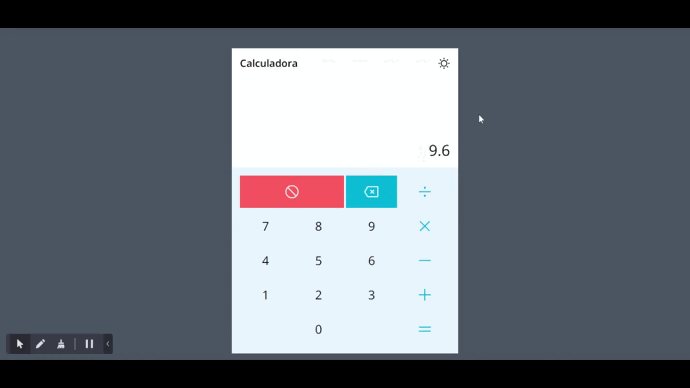

<p align="center" margin-top="25px" >
  

  

  
</p>



<a href="https://calculadora-three-pied.vercel.app/">Link do projeto</a>

# 🧠 Sobre

Calculadora simples em React e TypeScript


# 📚 Tecnologias utilizadas

<div style="display: flex">
  
  <a href="https://reactjs.org/"> - React</a><br/>
  
  <a href="https://www.typescriptlang.org/"> - Typescript</a><br/>
  
  <a href="https://reactjs.org/"> - HTML</a><br/>
  
  <a href="https://sass-lang.com/"> - TailwindCSS</a><br/>
  
</div>
    
# ⚙️ Instalação

```bash
# Clone o repositório
$ git clone https://github.com/Mahflima/calculadora.git

# Entre no repositório
$ cd calculadora

# Instale as dependências
$ npm install

# Execute a aplicação
$ npm run dev
```

<p align="center">Made with 💜 by Mariana Lima</p>
